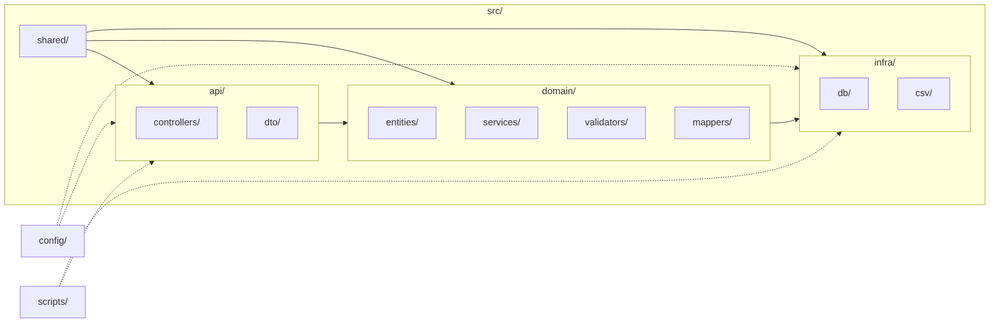

# 4+1 — Vista de Desarrollo · SkyTrack AI
**Fecha:** 2025-08-23

**Objetivo:** organizar el proyecto para facilitar evolución y pruebas.

## Representación visual (estructura y dependencias)


**Leyenda de dependencias**
- **api → domain → infra** (regla principal; no al revés).
- **shared** aporta utilidades y tipos a todas las capas.
- **config** y **scripts** interactúan de forma auxiliar (líneas punteadas).

## Estructura propuesta (detalle)
```text
src/
  api/
    controllers/
      order.controller.ts
      event.controller.ts
    dto/
      create-order.dto.ts
      create-event.dto.ts
  domain/
    entities/
      supply-order.ts
      supply-item.ts
      tracking-event.ts
    services/
      order.service.ts
      event.service.ts
    validators/
      event.validator.ts
    mappers/
      order.mapper.ts
      event.mapper.ts
  infra/
    db/
      migrations/
      repositories/
        order.repository.ts
        event.repository.ts
      prisma-or-orm-config.ts
    csv/
      import.service.ts
      export.service.ts
  shared/
    errors/
    types/
    utils/
config/
scripts/
```

## Reglas de dependencia
- **api → domain → infra** (nunca al revés).
- **DTOs** solo en `api/` (no contaminan el dominio).
- **Repositorios** solo desde servicios del dominio.
- **shared/** sin dependencias cíclicas.

## Calidad base
- Linter + formatter.
- Tests básicos para servicios (y validadores).
- Commits con convención (feat, fix, chore, docs…).
