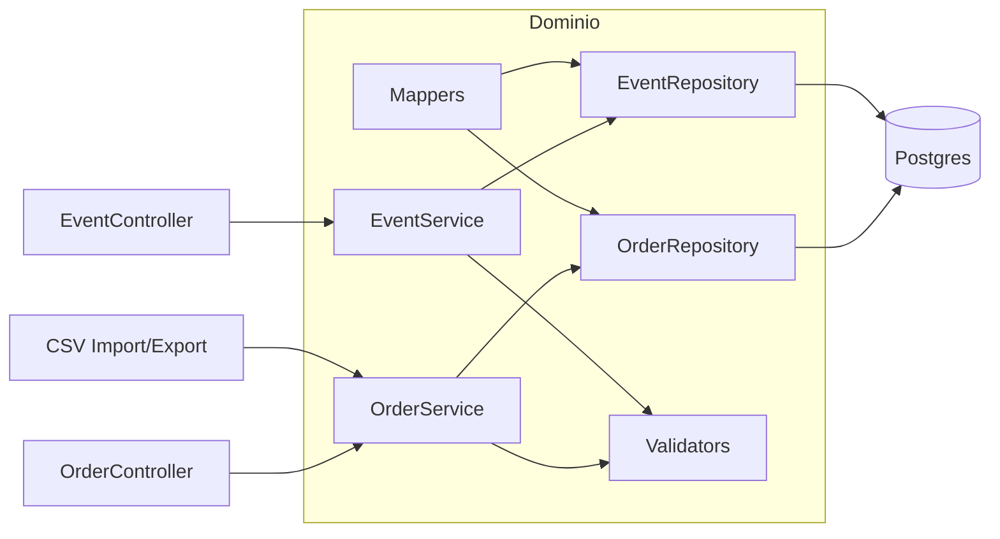

# 4+1 — Vista Lógica · SkyTrack AI
**Fecha:** 2025-08-23

**Objetivo:** aclarar componentes y sus responsabilidades sin entrar a implementación.

## Componentes principales
- **OrderController / EventController**: validan entrada y delegan al dominio.
- **OrderService / EventService**: reglas de negocio (estado por eventos, idempotencia, validaciones).
- **OrderRepository / EventRepository**: acceso a datos (consultas, persistencia).
- **Validators**: tipos de evento, formatos de tiempo (UTC), existencia de `orderId`.
- **Mappers**: DTO ↔ dominio ↔ persistencia.
- **CSV Import/Export**: batch de entrada/salida (carpetas `csv/in`, `csv/out`).

## Relaciones (diagrama)

## Decisiones clave
- **Estado** de la orden = proyección del **último evento válido**.
- **Idempotencia** por clave natural `orderId + type + at` (tolerancia razonable).
- **UTC** para timestamps; validaciones de formato.
