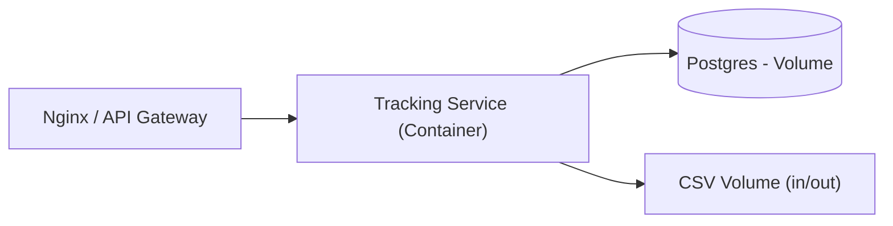

# 4+1 — Vista Física · SkyTrack AI
**Fecha:** 2025-08-23

**Objetivo:** despliegue mínimo para demos y práctica.

## Topología (demo)

## Consideraciones
- Variables de entorno (DB URL, JWT secret).
- Volúmenes: **DB** y **CSV** persistentes.
- TLS en Nginx (opcional para demo).
- Logs y métricas desde el día 1.
