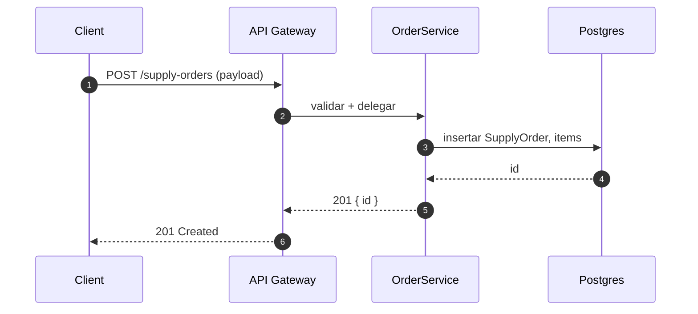

# Vista de Procesos por Rol · SkyTrack AI — Desarrollo (Backend)
**Fecha:** 2025-08-23
**Rol:** Desarrollo / Backend
**Objetivo:** Entender el **orden exacto** de llamadas y respuestas.

> Nota: en GitHub, algunas versiones de Mermaid no soportan `hide footbox`. Se omite para asegurar renderizado.

## Diagrama de secuencia (compatible con GitHub)

## Puntos de revisión
- Validaciones en gateway vs. dominio (qué va en cada capa).
- Idempotencia (si aplica) y manejo de errores.
- Contratos de entrada/salida (payloads).
