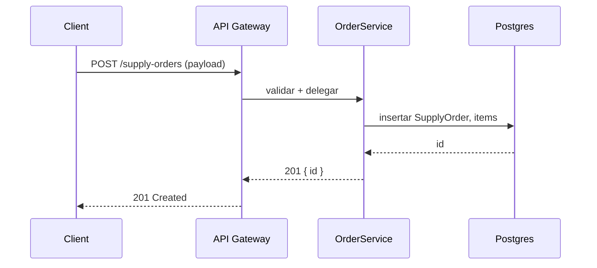
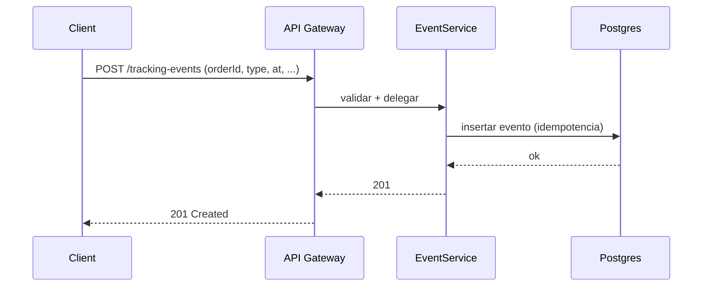

# 4+1 — Vista de Procesos · SkyTrack AI
**Fecha:** 2025-08-23

**Objetivo:** describir cómo fluyen las solicitudes en los casos clave.

## Crear SupplyOrder

## Registrar TrackingEvent

## Errores típicos
- **400**: `type` inválido / timestamp mal formado.
- **404**: `orderId` no existe.
- **409**: duplicado por idempotencia.
