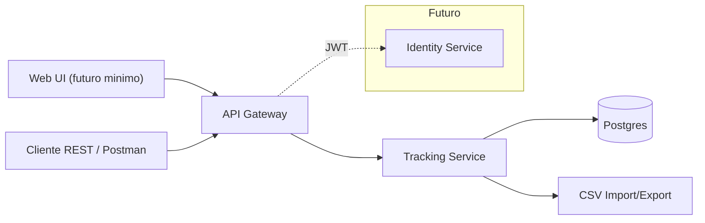

# C4 — Nivel 2 (Contenedores) · SkyTrack AI

**Fecha:** 2025-08-22

**Objetivo:** Descomponer el sistema en contenedores implementables.

**Notas**
- **Tracking Service** concentra las reglas de negocio de `SupplyOrder` y `TrackingEvent`
  (estado por eventos e idempotencia).
- **DB – Postgres** como almacén principal para consultas y reportes básicos. *(ADR-001)*
- **CSV Import/Export** para integración batch con ERP/WMS/Excel; carpetas `csv/in` y `csv/out`
  (ej. `orders_YYYYMMDD.csv`, `reconciliation_YYYYMMDD.csv`). *(ADR-003)*
- **Identity** queda fuera del MVP; por ahora **JWT** simple emitido/validado por la API. *(ADR-004)*
- *(Opcional)* **Web UI** es futuro; en el MVP se interactúa vía API/cliente REST.

