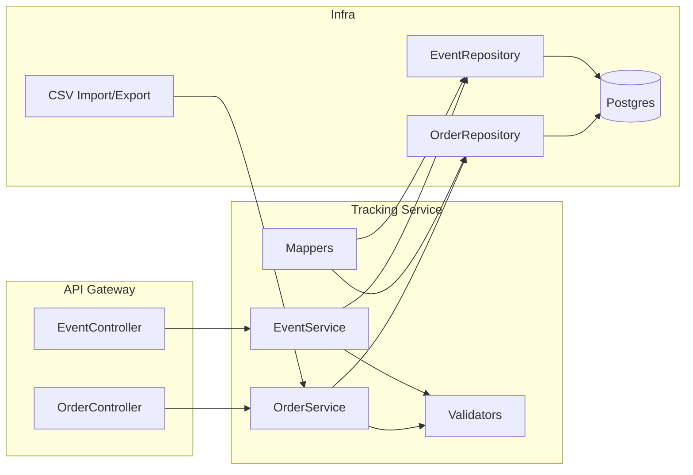

# C4 — Nivel 3 (Componentes) · SkyTrack AI
**Fecha:** 2025-08-22

**Objetivo:** Descomponer el Tracking Service en componentes.

**Notas**
- Estado proyectado por eventos: `requested → picked → in_transit → delivered → verified`.
- Idempotencia por clave natural `orderId + type + at`.
- Errores típicos: `400` (type inválido), `404` (orderId no existe), `409` (duplicado idempotente).
